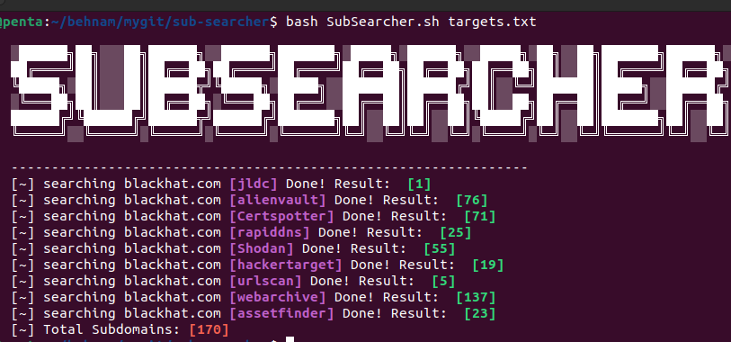

# SubSearcher - Mass Subdomain Scanner Bash Script 

SubSearcher is a bash script designed to efficiently discover subdomains associated with a given target list. By leveraging a combination of public DNS records, common subdomain patterns, and online sources, this tool provides a comprehensive list of potential subdomains for further investigation or penetration testing.




## Usage

```
bash SubSearcher.sh targets.txt
```
> Note1 : Targets should not include http/https/www !
> Note2 : Insert your Shodan API key into the SubSearcher.sh script at the SHODAN_APIKEY variable.

## Requirments

this tool used assetfinder;
```
sudo apt install assetfinder
```

## Disclaimer
This software has been created purely for the purposes of academic research and for the development of effective defensive techniques, and is not intended to be used to attack systems except where explicitly authorized. Project maintainers are not responsible or liable for misuse of the software. Use responsibly.


